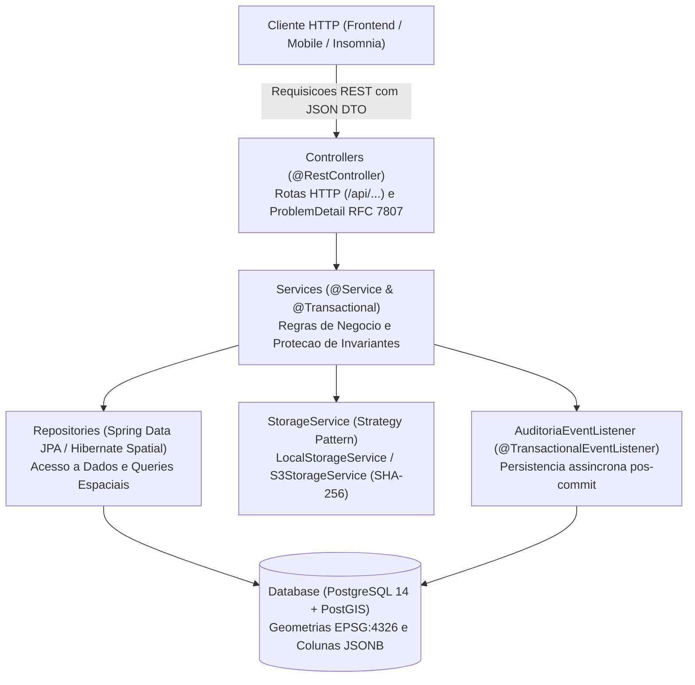

# SIP-MA — Sistema de Informacao do Patrimonio (Maranhao)

O **SisTomPatrimonio** e uma plataforma corporativa e estadual de geoprocessamento, salvaguarda e controle documental projetada para mapear, proteger e fiscalizar a heranca cultural tangivel (bens materiais edificados), intangivel (patrimonio imaterial/folclore) e arqueologica do Estado do Maranhao.

---

## Colaboracao

Antes de contribuir, leia o [guia de contribuicao](CONTRIBUTING.md). O projeto utiliza Pull Requests para alteracoes na branch `main`, validacao automatica pelo GitHub Actions e revisao definida em [.github/CODEOWNERS](.github/CODEOWNERS).

---

## Sumario
1. [Visao Geral e Proposito do Sistema](#1-visao-geral-e-proposito-do-sistema)
2. [Diferenciais de Engenharia e Arquitetura](#2-diferenciais-de-engenharia-e-arquitetura)
3. [Analise do Dominio e Desafios de Negocio](#3-analise-do-dominio-e-desafios-de-negocio)
4. [Escolhas Arquiteturais e Padroes de Engenharia](#4-escolhas-arquiteturais-e-padroes-de-engenharia)
5. [Estrutura Completa do Projeto Backend](#5-estrutura-completa-do-projeto-backend)
6. [Modelo de Dados Fisico, Espacial (PostGIS) e Hibrido (JSONB)](#6-modelo-de-dados-fisico-espacial-postgis-e-hibrido-jsonb)
7. [Catalogo Completo de APIs RESTful](#7-catalogo-completo-de-apis-restful)
8. [Estrategia de Qualidade e Testes Automatizados](#8-estrategia-de-qualidade-e-testes-automatizados)
9. [Analise Critica: Falhas Criticas e Paridade Ambiental (H2 vs. Testcontainers)](#9-analise-critica-falhas-criticas-e-paridade-ambiental-h2-vs-testcontainers)
10. [Guia Passo a Passo de Execucao](#10-guia-passo-a-passo-de-execucao)

---

## 1. Visao Geral e Proposito do Sistema

O Sistema de Informacao do Patrimonio do Estado do Maranhao (**SIP-MA**) atua como a infraestrutura de dados espaciais e administrativos centralizada para a **SECMA** (Secretaria de Estado da Cultura do Maranhao), operando em sintonia com o **IPHAN**, Prefeituras Municipais e o **Ministerio Publico Estadual**.

### O Escopo Abrange as 3 Naturezas do Patrimonio Cultural:
1. **Material Edificado:** Casaroes historicos, igrejas, monumentos e conjuntos urbanos tombados de cidades como Sao Luis, Alcantara e Caxias.
2. **Imaterial (Intangivel):** Manifestacoes culturais, tradicoes, festas, saberes e celebracoes (ex: Bumba Meu Boi, Tambor de Crioula, Rito do Divino Espirito Santo).
3. **Arqueologico:** Sitios arqueologicos pre-coloniais, sambaquis, inscricoes rupestres e ruinas historicas.

---

## 2. Diferenciais de Engenharia e Arquitetura

Ao contrario de sistemas tradicionais de tombamento interno de ativos, o SIP-MA foi projetado para escala estadual macro, incorporando decisoes arquiteturais avancadas de software formalizadas na pasta [docs/04-adr/](file:///home/josue/Área%20de%20trabalho/SisTomPatrimonio/docs/04-adr/):

* **Arquitetura em Camadas Desacopladas**: Backend estruturado estritamente em `Controllers` (REST/DTOs), `Services` (Regras de negocio e transacoes `@Transactional`), `Repositories` (Spring Data JPA / Hibernate Spatial) e `Entities` (JPA/PostGIS).
* **Identificacao Unica por UUIDs**: Todas as chaves primarias e relacionamentos utilizam UUIDs de 128 bits (`java.util.UUID`), garantindo interoperabilidade entre sistemas governamentais sem colisoes de IDs.
* **Geoprocessamento com PostGIS**: Suporte nativo a geometrias espaciais JTS (`Point`, `Polygon`, `MultiPolygon`) sob o sistema de referencia `EPSG:4326` (WGS 84).
* **Isolamento de Seguranca Arqueologica**: Separacao fisica e relacional 1:1 das coordenadas exatas de sitios arqueologicos sensiveis para protecao contra saques e vandalismo.
* **Modelagem Hibrida com JSONB**: Utilizacao do suporte `jsonb` do PostgreSQL no Hibernate 6 (`@JdbcTypeCode(SqlTypes.JSON)`) para catalogar equipes tecnicas, patologias de conservacao, metas de salvaguarda e trilhas de auditoria, evitando proliferacao excessiva de tabelas associativas.
* **Estrategia Zero Bytea (Midias Digitais)**: Armazenamento externo de midias e documentos em storage/S3, mantendo no banco de dados apenas a chave logica (`storageKey`) e o hash **SHA-256** de integridade.
* **Auditoria Desacoplada e Assincrona**: Trilha transacional disparada via eventos de dominio (`AuditoriaEvent`) consumidos assincronamente por `AuditoriaEventListener` com `@TransactionalEventListener(phase = AFTER_COMMIT)`.
* **Strategy Pattern para Storage**: Interface abstrata `StorageService` com suporte a `LocalStorageService` (disco local) e `S3StorageService` (AWS S3/MinIO).
* **Seguranca Stateless via JWT**: Autenticacao baseada em Spring Security, codificacao de senhas via BCrypt e suporte a flag declarativa de 2FA.
* **Protecao de Invariantes no Dominio**: Entidades ricas com validacao de ciclo de vida e regras de negocio blindadas.

---

## 3. Analise do Dominio e Desafios de Negocio

A gestao de patrimonio cultural em escala estadual enfrenta gargalos operacionais que o SIP-MA foi projetado para resolver:

* **Dispersao de Dados:** Historico de portarias, laudos periciais e vistorias descentralizados em arquivos fisicos ou planilhas suscetiveis a perdas.
* **Ausencia de Georreferenciamento Cartografico:** Falta de delimitacao precisa de zonas de tombamento e areas de amortecimento (entorno).
* **Vulnerabilidade de Sitios Arqueologicos:** A exposicao publica indevida das coordenadas exatas de sitios arqueologicos resulta em saques, vandalismo e destruicao irreversivel do acervo.
* **Heterogeneidade do Dominio:** Um imovel historico possui metricas fisicas (area, pavimentos, estrutura) completamente incompativeis com uma danca folclorica imaterial. Modelagens relacionais estritas geravam *table bloat* (tabelas com excesso de colunas nulas).

---

## 4. Escolhas Arquiteturais e Padroes de Engenharia

O backend do SIP-MA adota um padrao rigoroso de **Arquitetura em Camadas Desacopladas (Cliente-Servidor / REST)**:



### Principais Decisoes Tecnologicas:
* **Identificadores Globais Universais (UUID 128-bit):** Todas as entidades utilizam `java.util.UUID` como chave primaria, assegurando interoperabilidade com outros sistemas governamentais sem colisoes de IDs.
* **Padrao DTO (Data Transfer Objects):** Nenhuma entidade JPA/Hibernate e exposta diretamente na API REST, protegendo o modelo de dados e evitando vazamento de atributos internos.
* **Modelagem Hibrida Relacional + JSONB:** Uso das colunas `jsonb` do PostgreSQL no Hibernate 6 (`@JdbcTypeCode(SqlTypes.JSON)`) para gerenciar equipes tecnicas, patologias em vistorias, metas de salvaguarda e auditoria sem criar tabelas filhas desnecessarias.
* **Estrategia Zero Bytea (RNF05):** Midias e documentos sao mantidos em buckets externos/storage. O PostgreSQL armazena apenas a URL/chave logica (`storageKey`) e o hash **SHA-256** para checagem de integridade.
* **Seguranca Stateless e Controle de Acesso (RBAC):** Protecao via Spring Security com tokens JWT, senhas criptografadas com **BCrypt**, indicador de **2FA** e perfis de acesso (`ADMIN`, `TECNICO`, `CONSULTOR`, `LEITOR`, `JURIDICO`).
* **Tratamento Global de Excecoes:** Excecoes de negocio lancam a classe personalizada `RegraNegocioRunTime`, que e capturada e convertida automaticamente em respostas HTTP `400 Bad Request` no formato RFC 7807 (`ProblemDetail`).

---

## 5. Estrutura Completa do Projeto Backend

```text
SisTomPatrimonio/
├── .github/
│   ├── CODEOWNERS                              # Mantenedores responsaveis pela revisao
│   ├── PULL_REQUEST_TEMPLATE.md                # Template de abertura de PR
│   └── workflows/
│       ├── ci.yml                              # Pipeline CI de build e testes (JDK 17 LTS)
│       └── release.yml                         # Pipeline de release automatizado (JDK 17 LTS)
├── docs/                                       # Suite completa de documentacao e ADRs
├── insomnia-SisTomPatrimonio-collection.json   # Colecao de requisicoes para testes REST
├── docker-compose.yaml                         # Container PostgreSQL 14 + PostGIS
├── pom.xml                                     # Dependencias Maven (Spring Boot 3.4.1, Java 17 LTS)
├── README.md                                   # Documentacao e guia do projeto
├── CONTRIBUTING.md                             # Guia de contribuicao e padroes de branch/commit
├── .env.example                                # Exemplo de variaveis de ambiente
└── src/
    ├── main/
    │   ├── java/br/com/SisTomPatrimonio/SisTomPatrimonio/
    │   │   ├── SisTomPatrimonioApplication.java
    │   │   ├── config/                         # Seguranca e beans do Spring
    │   │   ├── controllers/                    # Endpoints RESTful
    │   │   ├── dtos/                           # Data Transfer Objects
    │   │   ├── events/                         # Eventos de dominio (AuditoriaEvent)
    │   │   ├── exceptions/                     # Tratamento global de excecoes (ProblemDetail RFC 7807)
    │   │   ├── listeners/                      # Listeners assincronos (@TransactionalEventListener)
    │   │   ├── models/
    │   │   │   ├── entities/                   # Entidades JPA e geometrias PostGIS (15 tabelas)
    │   │   │   └── enums/                      # Enums de dominio
    │   │   ├── repositories/                   # Interfaces Spring Data JPA / PostGIS
    │   │   ├── services/                       # 9 servicos com regras de negocio e invariantes
    │   │   └── storage/                        # Strategy Pattern (LocalStorageService / S3StorageService)
    │   └── resources/
    │       ├── application.yml                 # Configuracao principal da aplicacao
    │       └── db/migration/
    │           └── V1__estrutura_inicial_patrimonio_cultural.sql  # Migrations Flyway do schema PostGIS
    └── test/
        ├── java/br/com/SisTomPatrimonio/SisTomPatrimonio/
        │   ├── controllers/                    # Testes de integracao web (MockMvc)
        │   ├── listeners/                      # Testes de listener de eventos
        │   ├── models/entities/                # Testes unitarios de invariantes de dominio
        │   ├── repositories/                   # Testes de persistencia com H2 espacial
        │   ├── services/                       # 9 suites de testes unitarios de servicos
        │   ├── storage/                        # Testes do servico de armazenamento e SHA-256
        │   ├── AbstractIntegrationTest.java
        │   └── SisTomPatrimonioApplicationTests.java
        └── resources/
            └── application-test.properties     # Perfil isolado de teste em memoria H2
```

---

## 6. Modelo de Dados Fisico, Espacial (PostGIS) e Hibrido (JSONB)

O banco de dados relacional e geoespacial do SIP-MA e composto por **15 tabelas interdependentes**:

| Tabela / Entidade | Funcao no Sistema | Tipo de Dados / Destaque Arquitetural |
| :--- | :--- | :--- |
| **`usuario`** | Servidores, peritos e advogados da SECMA | UUID [PK], `perfil` ENUM, flag `dois_fatores`. |
| **`organizacao`** | Instituicoes governamentais e de salvaguarda (SECMA, IPHAN) | UUID [PK], CNPJ unico. |
| **`municipio`** | Base cartografica espacial dos municipios do Maranhao | UUID [PK], Geometria `MultiPolygon` PostGIS (EPSG:4326). |
| **`bem_cultural`** | Centralizador unificado de ativos materiais, imateriais e arqueologicos | UUID [PK], `natureza` ENUM, atributo dinamico `dados_especificos` JSONB. |
| **`localizacao_bem`** | Coordenadas publicas e endereco postal de monumentos | UUID [PK], Geometria `Point` ou `Polygon` PostGIS (EPSG:4326). |
| **`localizacao_arqueologica_restrita`** | Isolamento de seguranca 1:1 de coordenadas exatas de sitios arqueologicos | UUID [PK], Geometria `geom_exata` Point e `buffer_protecao` Polygon. |
| **`protecao`** | Processo legal de tombamento, decreto e livro de tombo | UUID [PK], `fase` ENUM, controle de vigencia. |
| **`vistoria`** | Inspecoes preventivas de conservacao e patologias | UUID [PK], colunas dinamicas `equipe` JSONB e `patologias` JSONB. |
| **`processo_judicial`** | Acoes judiciais de embargo, dano e preservacao | UUID [PK], numero padronizado CNJ unico. |
| **`processo_bem`** | Tabela associativa N:N entre acoes judiciais e bens | Chave composta `ProcessoBemId` (`processo_id`, `bem_id`). |
| **`movimentacao_judicial`** | Historico sequencial de andamentos dos processos judiciais | UUID [PK], ordem sequencial de andamentos. |
| **`documento`** | Repositorio polimorfico de plantas, portarias e laudos | UUID [PK], armazena `storageKey` (Zero Bytea) e hash `sha256`. |
| **`evento_bem`** | Linha do tempo historica de restauros e intervencoes | UUID [PK], `tipo` ENUM, anos e datas de inicio/fim. |
| **`salvaguarda`** | Planos de acao e apoio ao patrimonio imaterial | UUID [PK], plano detalhado na coluna `acoes` JSONB. |
| **`auditoria`** | Trilha transacional imutavel de alteracao de dados | BIGINT [PK], grava instantaneos `dados_anteriores` e `dados_novos` em JSONB. |

---

## 7. Catalogo Completo de APIs RESTful

Todas as rotas estao implementadas e disponiveis para execucao direta na colecao do Insomnia:

### Modulo Usuarios e Seguranca (`/api/usuarios`)
* `POST /api/usuarios`: Cadastra novos usuarios/peritos com senha criptografada via BCrypt. Retorna `UsuarioResponseDTO` sem vazamento de senha.
* `POST /api/usuarios/autenticar`: Efetua autenticacao e emite os dados do usuario logado.

### Modulo Core Patrimonial (`/api/v1/bens-culturais`)
* `POST /api/v1/bens-culturais`: Registra novo bem cultural (Material, Imaterial ou Arqueologico). Exige header `X-Usuario-Id`.
* `GET /api/v1/bens-culturais/proximidade?latitude={lat}&longitude={lng}&raioMetros={raio}`: Busca bens por proximidade geografica via consulta espacial PostGIS com paginacao.
* `PATCH /api/v1/bens-culturais/{id}/publicar`: Homologa o ciclo de vida do bem para publicacao no acervo. Exige header `X-Usuario-Id`.
* `PATCH /api/v1/bens-culturais/{id}/arquivar`: Transicao de ciclo de vida para arquivamento institucional. Exige header `X-Usuario-Id`.

### Modulo Vistorias e Fiscalizacao (`/api/v1/vistorias`)
* `POST /api/v1/vistorias`: Agenda nova vistoria tecnica preventiva com catalogacao de equipe e patologias em JSONB.
* `GET /api/v1/vistorias/bem/{bemId}`: Lista o historico completo de vistorias vinculadas a um bem cultural.
* `POST /api/v1/vistorias/{id}/homologar`: Homologacao pericial de vistoria realizada. Exige header `X-Usuario-Id`.

### Modulo Tombamento Legal e Protecao (`/api/v1/protecoes`)
* `POST /api/v1/protecoes`: Emite o registro de processo de tombamento (instrucao ou homologacao formal em Livro do Tombo com decreto).
* `GET /api/v1/protecoes/bem/{bemId}`: Lista os processos de protecao e tombamento associados a um bem cultural.

### Modulo Documentos e Midias (`/api/v1/documentos`)
* `POST /api/v1/documentos`: Cadastra metadados de plantas, fotos e laudos validando hash criptografico SHA-256 e chave no storage externo.
* `GET /api/v1/documentos/bem/{bemId}`: Lista todos os documentos associados a um bem cultural.

### Modulo Eventos e Linha do Tempo (`/api/eventos`)
* `POST /api/eventos`: Registra novo evento ou intervencao na linha do tempo historica do bem (`RESTAURO`, `INTERVENCAO`, etc.).
* `GET /api/eventos/bem/{bemId}`: Consulta a cronologia historica de intervencoes de um bem cultural.

### Modulo Processos Judiciais (`/api/processos-judiciais`)
* `POST /api/processos-judiciais`: Cadastra acao judicial de preservacao por numero unico CNJ.
* `GET /api/processos-judiciais`: Lista todos os processos judiciais cadastrados na base.

### Modulo Salvaguarda Imaterial (`/api/salvaguardas`)
* `POST /api/salvaguardas`: Cadastra plano de salvaguarda para bens imateriais (aplica a regra RN02, bloqueando bens materiais).
* `GET /api/salvaguardas/bem/{bemId}`: Lista os planos de salvaguarda vinculados a um bem imaterial.

### Modulo Auditoria Transacional (`/api/v1/auditorias`)
* `GET /api/v1/auditorias/entidade/{entidade}/{entidadeId}`: Consulta paginada da trilha de auditoria e snapshots JSONB de modificacoes de uma entidade.

---

## 8. Estrategia de Qualidade e Testes Automatizados

O SIP-MA adota uma abordagem de testes rigorosa e repetivel estruturada no padrao **Cenario -> Acao -> Verificacao**:

1. **Testes de Unidade nos Services (JUnit 5 + Mockito):**
   * Avaliam isoladamente as regras de negocio em metodos das classes `@Service`.
   * Utilizam `@Mock` e `@InjectMocks` para isolar chamadas de banco e validar se restricoes violadas lancam a excecao `RegraNegocioRunTime`.
2. **Testes de Controllers REST (MockMvc + `@WebMvcTest`):**
   * Validam mapeamentos de rotas, serializacao JSON e codigos de status HTTP (`201 Created`, `200 OK`, `400 Bad Request`).
   * Utilizam o utilitario `MockMvc` com `@MockBean` para simular requisicoes web sem subir o servidor Tomcat.
3. **Testes de Persistencia e Repositorios (H2 em Memoria):**
   * Utilizam `@SpringBootTest` com `@ActiveProfiles("test")` para testar mapeamentos JPA, constraints e consultas em JPQL contra um banco em memoria isolado (`jdbc:h2:mem:sipma_test`).
4. **Homologacao Atual**:
   * **79 testes automatizados com 100% de sucesso (0 falhas, 0 erros)** cobrindo todos os 9 servicos de negocio, listeners de auditoria, storage e invariantes de entidades.

---

## 9. Analise Critica: Falhas Criticas e Paridade Ambiental (H2 vs. Testcontainers)

### Analise de Falhas Criticas de Dominio
1. **Vazamento de Coordenadas Arqueologicas (`localizacao_arqueologica_restrita`):** A exposicao das coordenadas exatas (`geom_exata`) de sitios sensiveis para perfis sem credencial (`LEITOR`) resulta em vandalismo e saques fisicos.
   * *Mitigacao:* DTOs de resposta geral nunca contem o no espacial restrito, e o `BemCulturalService` exige validacao de perfil `ADMIN`/`TECNICO` e registro de fundamentacao em auditoria.
2. **Quebra da Trilha de Auditoria Legal:** A ausencia de logs em operacoes em lote compromete a validade juridica de processos de tombamento.
   * *Mitigacao:* Listeners JPA e eventos sincronos/assincronos gravam snapshots `dados_anteriores` e `dados_novos` em colunas `jsonb` de forma transacional.
3. **Violacao do RNF05 (Zero Bytea):** Armazenar binarios no PostgreSQL causa *table bloat* e lentidao do banco.
   * *Mitigacao:* Armazenamento estrito de referencias logicas (`storageKey`) e verificacao via hash **SHA-256**.

---

### Discussao Tecnica: H2 vs. Testcontainers em CI/CD e Escopo Academico

A decisao de substituir totalmente o **H2** pelo **Testcontainers** (`postgis/postgis:14-3.3-alpine`) deve ser analisada sob dois prismas distintos: **o ambiente real de producao/CI-CD governamental** versus **o projeto academico de entrega e avaliacao da disciplina**.

#### Prisma 1: Escopo Academico e Avaliacao Disciplinar (Abordagem Atual com H2)
* **Sem Dependencia do Daemon do Docker:** Permite executar `./mvnw test` em qualquer ambiente operacional imediatamente, sem a exigencia de ter o Docker rodando em background.
* **Velocidade de Execucao:** O H2 sobe o contexto de teste em memoria em poucos segundos (~9 a 14 segundos), facilitando a execucao rapida durante o desenvolvimento.
* **Alinhamento Pedagogico:** Atende com precisao as diretrizes da disciplina, utilizando o perfil de testes (`application-test.properties`) com suporte a dialeto espacial H2.

#### Prisma 2: Producao Real e Pipeline CI/CD Governamental (Uso do Testcontainers)
* **Divergencia entre Motores Espaciais:** O H2 com `H2SpatialDialect` emula calculos geodesicos em Java atraves da biblioteca JTS. Ja o **PostGIS** em producao executa rotinas espaciais nativas em C/C++ (GEOS, GDAL, PROJ).
* **Prevencao de Falsos Positivos:** Operacoes espaciais complexas em SRID `EPSG:4326` (como `ST_Contains` em poligonos de amortecimento ou `ST_Intersects`) podem passar "verde" no H2, mas apresentar diferencas de precisao flutuante ou incompatibilidades de funcoes SQL no PostGIS real.
* **100% de Paridade Ambiental (12-Factor App):** Adocao da biblioteca Testcontainers em esteiras de integracao continua para levantar temporariamente a imagem exata `postgis/postgis:14-3.3-alpine`, executando as migrations reais do Flyway e garantindo paridade ambiental perfeita antes do deploy.

---

## 10. Guia Passo a Passo de Execucao

Este guia descreve como configurar, rodar, executar a suite de testes e testar os endpoints REST do SIP-MA:

---

### Passo 1: Pre-requisitos
Garanta que as seguintes ferramentas estejam instaladas:
1. **JDK 17 LTS** (Java Development Kit).
2. **Apache Maven 3.8+** (ou utilizar o Maven Wrapper incluso `./mvnw`).
3. **Docker** (para subir o banco PostgreSQL + PostGIS via Docker Compose).
4. **Git** (para controle de versao).
5. **Insomnia REST Client** (para testar os endpoints da API).

---

### Passo 2: Clonar e Abrir o Projeto
```bash
# 1. Clonar o repositorio
git clone https://github.com/joseremedios-max/SisTomPatrimonio.git

# 2. Entrar na pasta raiz do projeto
cd SisTomPatrimonio

# 3. Abrir o projeto na IDE (exemplo VS Code)
code .
```

---

### Passo 3: Subir o Banco de Dados PostGIS via Docker
Com o Docker em execucao, abra o terminal na raiz do projeto onde esta o arquivo `docker-compose.yaml` e execute:
```bash
docker compose up -d postgres-spatial
```
*O Docker inicializara o container `postgis/postgis:14-3.3-alpine` na porta `5432`.*

---

### Passo 4: Executar a Suite de Testes Automatizados
Para rodar todos os 79 testes unitarios e de integracao sobre o banco H2 em memoria:
```bash
./mvnw test
```

---

### Passo 5: Subir a Aplicacao Spring Boot
Para rodar a API RESTful localmente na porta `8080`:
```bash
./mvnw spring-boot:run
```
*Durante a inicializacao, o **Flyway** executara automaticamente o script `V1__estrutura_inicial_patrimonio_cultural.sql`, criando as 15 tabelas e extensoes espaciais do PostGIS.*

---

### Passo 6: Testar as Rotas da API com o Insomnia
1. Abra o **Insomnia REST Client**.
2. Clique em **Import** -> **Import From File**.
3. Selecione o arquivo **`insomnia-SisTomPatrimonio-collection.json`** localizado na raiz do projeto.
4. Execute as requisicoes organizadas por modulos (`Usuarios`, `Bens culturais`, `Vistorias`, `Protecoes`, `Documentos`, `Eventos`, `Processos judiciais`, `Salvaguardas`, `Auditoria`).
