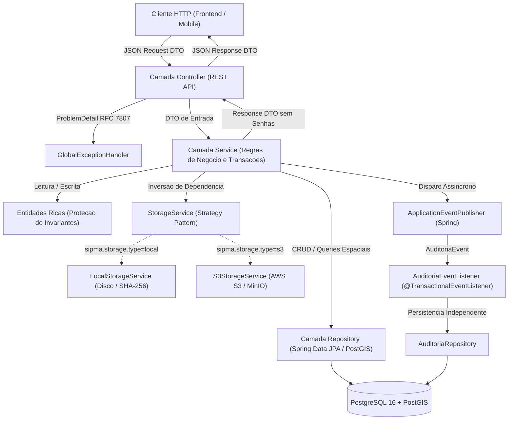
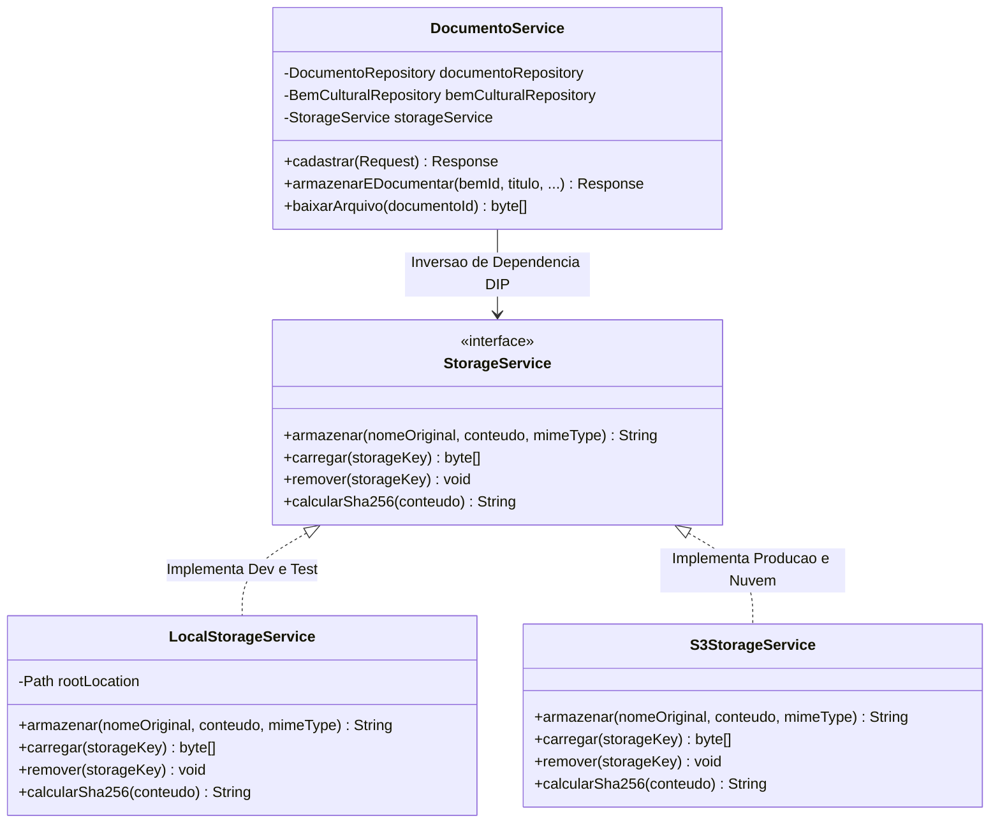
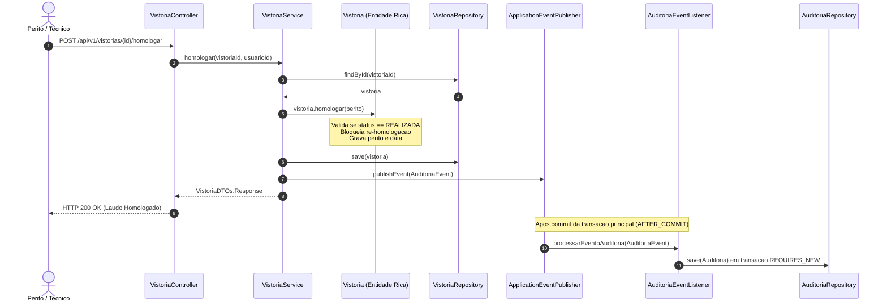

# Arquitetura de Software e Padroes de Projeto (SIP-MA)

Este documento descreve a arquitetura tecnica, os padroes de projeto aplicados e como os principios de **Alta Coesao** e **Baixo Acoplamento** sao garantidos em todo o codigo-fonte do SIP-MA.

---

## 1. Visao Geral da Arquitetura em Camadas

O sistema adota uma **Arquitetura em Camadas com Fronteiras Estritas de DTO**, garantindo que entidades JPA e detalhes internos de banco nunca vazem para a camada de apresentacao web.

---

## 2. Padroes de Projeto Implementados

### A. Strategy Pattern (Armazenamento de Arquivos)
Utilizado para isolar o servico de catalogacao documental `DocumentoService` dos detalhes fisicos de I/O de arquivos.

---

### B. Observer Pattern via Spring Domain Events (Auditoria Desacoplada)
Garante que a gravacao da trilha de auditoria nunca desacelere nem interrompa uma transacao de negocio principal caso ocorra uma falha de log.

---

### C. Dominio Rico (Invariantes na Entidade)
Diferente do Modelo Anemico, onde a entidade e passiva, no SIP-MA o proprio modelo responde por suas transicoes de estado:

1. **Vistoria**:
   * `homologar(Usuario homologador)`: So pode homologar se o status for `REALIZADA`. Ativa o booleano `homologada = true` e sela o laudo contra futuras edicoes.
   * `registrarRealizacao(...)`: Lanca excecao de negocio se tentar alterar dados de uma vistoria ja homologada.
2. **BemCultural**:
   * `publicar()`: Altera status para `PUBLICADO`, definindo o timestamp oficial de publicacao. Impede a publicacao de bens que estejam com status `ARQUIVADO`.
   * `arquivar(Usuario responsavel)`: Altera status para `ARQUIVADO` e registra auditoria institucional.

---

### D. Seguranca e Isolamento de DTOs
1. **Sem vazamento de senhas**: O objeto `Usuario` nunca e exposto no `UsuarioController`. Apenas `UsuarioResponseDTO` e retornado, sem a presenca da propriedade `senha`.
2. **RFC 7807 Global**: O `GlobalExceptionHandler` padroniza todos os erros com status semanticamente corretos:
   * `422 Unprocessable Entity`: Violacoes de regras de negocio do dominio (`RegraNegocioRunTime`).
   * `400 Bad Request`: Erros de validacao de campos `@Valid` e headers ausentes.
   * `404 Not Found`: Recursos nao localizados (`RecursoNaoEncontradoException`).
   * `409 Conflict`: Violacoes de integridade e duplicidades de banco.
