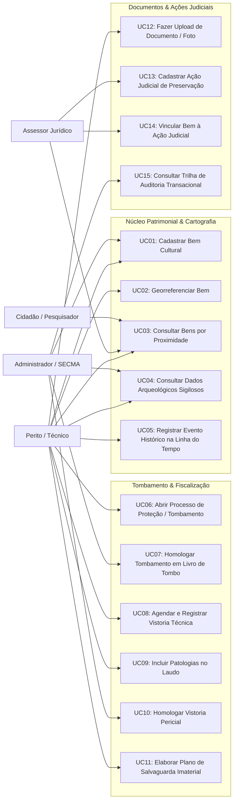

# Diagrama de Casos de Uso — SIP-MA

Este documento apresenta a modelagem funcional dos casos de uso do sistema, relacionando os perfis de usuários com as funcionalidades operacionais da plataforma.

---

## 1. Diagrama Geral de Casos de Uso (Mermaid)

---

## 2. Especificação dos Casos de Uso Críticos

### UC01 — Cadastrar Bem Cultural
* **Ator Principal**: `TECNICO`
* **Pré-condições**: Usuário autenticado e organização responsável cadastrada.
* **Fluxo Principal**:
  1. O técnico seleciona a natureza do bem (`MATERIAL_EDIFICADO`, `IMATERIAL`, `ARQUEOLOGICO`).
  2. Informa o código único, denominação oficial e descrição geral.
  3. Preenche os campos específicos da natureza (ex: área e pavimentos para imóveis; contexto para imateriais).
  4. O sistema valida as restrições e persiste o bem com status `RASCUNHO`.
* **Pós-condições**: Bem criado e evento de auditoria gerado.

### UC08 & UC10 — Vistoria Pericial e Homologação
* **Atores**: `TECNICO` (Execução) e `ADMIN` (Homologação).
* **Fluxo Principal**:
  1. O técnico agenda a vistoria e informa a equipe pericial (`JSONB`).
  2. Em campo, diagnostica anomalias físicas e alimenta o vetor de `patologias` em JSONB.
  3. Altera o status para `REALIZADA` e insere o resumo pericial e prazo de próxima vistoria.
  4. O Administrador/Superintendente revisa o laudo e executa a homologação (`UC10`).
  5. O sistema sela o registro com `homologada = true`, data/hora e identificador do homologador.
* **Pós-condições**: Laudo pericial tornado imutável para uso em processos públicos e judiciais.
