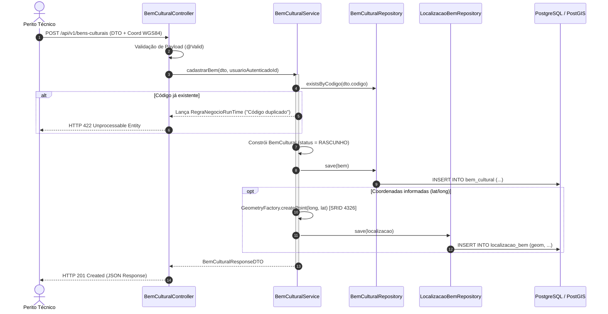
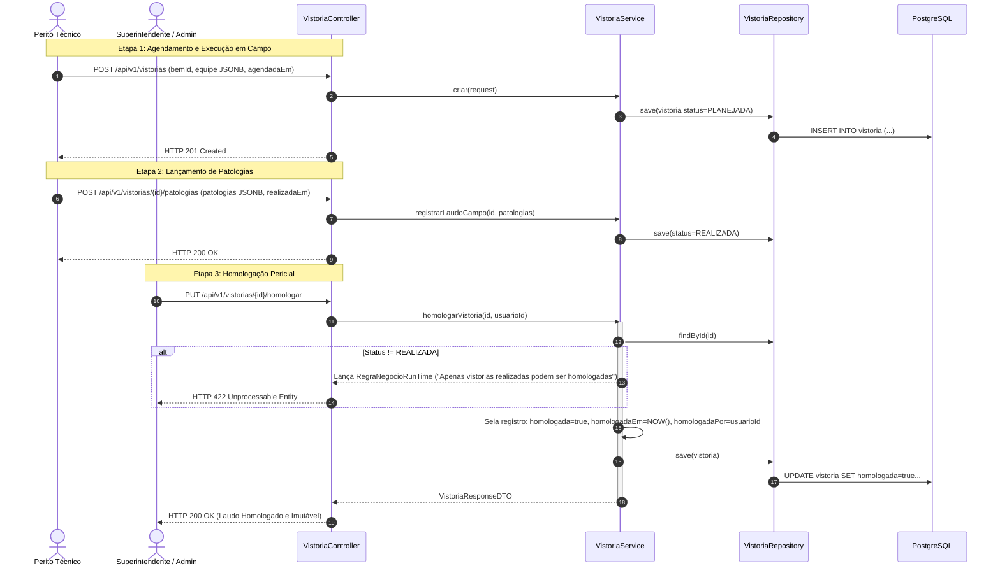
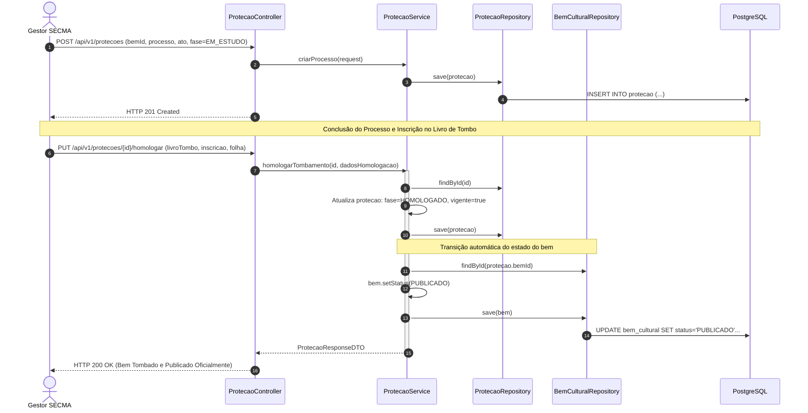
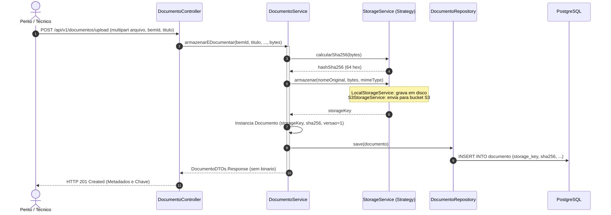
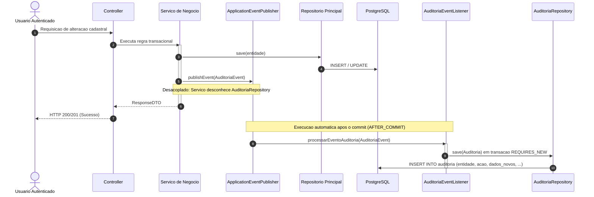

# Diagramas de Sequência e Fluxos Operacionais — SIP-MA

Este documento modela os fluxos dinâmicos e temporais de execução entre os atores, a camada de controle REST, a camada de serviços transacionais e a infraestrutura de banco de dados.

---

## 1. Fluxo: Cadastro de Bem Cultural e Georreferenciamento

---

## 2. Fluxo: Vistoria Pericial de Campo e Homologação

---

## 3. Fluxo: Processo de Tombamento e Inscrição em Livro de Tombo

---

## 4. Fluxo: Upload e Armazenamento Seguro de Documentos (Strategy Pattern e SHA-256)

---

## 5. Fluxo: Disparo e Processamento Assincrono de Auditoria (Domain Events)

