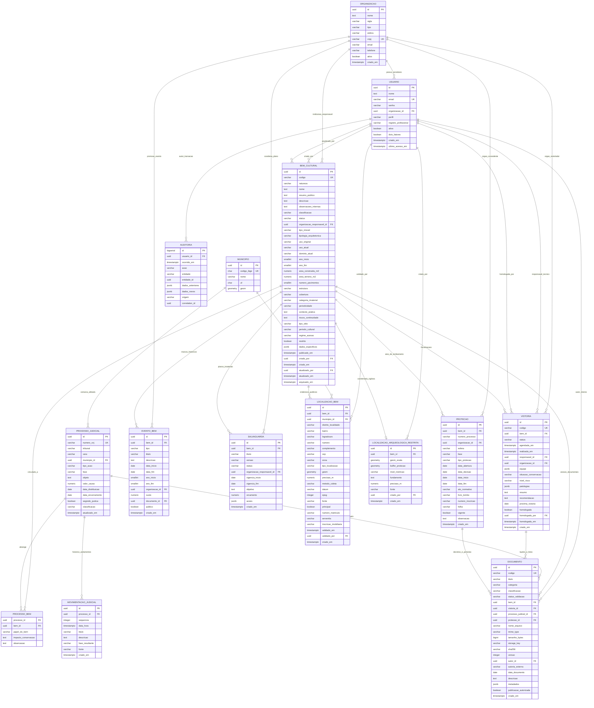

# Modelo de Dados — Diagrama Entidade-Relacionamento (DER)

Este documento contém a transcrição oficial do modelo físico e lógico do banco de dados relacional **PostgreSQL + PostGIS**, espelhando rigorosamente o `dbdiagram` oficial acordado para o projeto SIP-MA.

---

## 1. Diagrama Entidade-Relacionamento (Mermaid)

---

## 2. Dicionário de Dados Resumido (Tabelas Principais)

1. **`organizacao`**: Cadastro das entidades que tutelam ou custodiam o patrimônio (ex: SECMA, IPHAN, Prefeituras).
2. **`usuario`**: Servidores, peritos técnicos e assessores jurídicos com credenciais protegidas e RBAC.
3. **`municipio`**: Base cartográfica com limites poligonais do IBGE para relacionamentos geoespaciais automáticos.
4. **`bem_cultural`**: Tabela mestre do acervo. Unifica bens materiais, imateriais e arqueológicos com metadados estruturados e híbridos (`dados_especificos JSONB`).
5. **`localizacao_bem`**: Permite múltiplos endereços, coordenadas ou polígonos públicos por monumento, além de dados cartorários simplificados.
6. **`localizacao_arqueologica_restrita`**: Coordenadas sensíveis isoladas 1:1 para impedir divulgação não-autorizada de sítios arqueológicos.
7. **`protecao`**: Consolida em uma só tabela o processo administrativo de tombamento e o registro no Livro de Tombo estadual.
8. **`vistoria`**: Inspeção técnica física, catalogando a equipe pericial e anomalias prediais em colunas `JSONB`.
9. **`processo_judicial` & `processo_bem`**: Controle N:N de ações civis públicas, embargos e execuções de restauro.
10. **`documento`**: Repositório de anexos com chave S3, verificação de hash SHA-256 e vínculos polimórficos opcionais.
11. **`evento_bem`**: Linha do tempo de restauros, tombamentos, reformas e eventos marcantes na história do monumento.
12. **`salvaguarda`**: Planos de ação e fomento a patrimônios imateriais com metas em JSONB.
13. **`auditoria`**: Trilha transacional com snapshots lógicos dos estados anteriores e posteriores.
