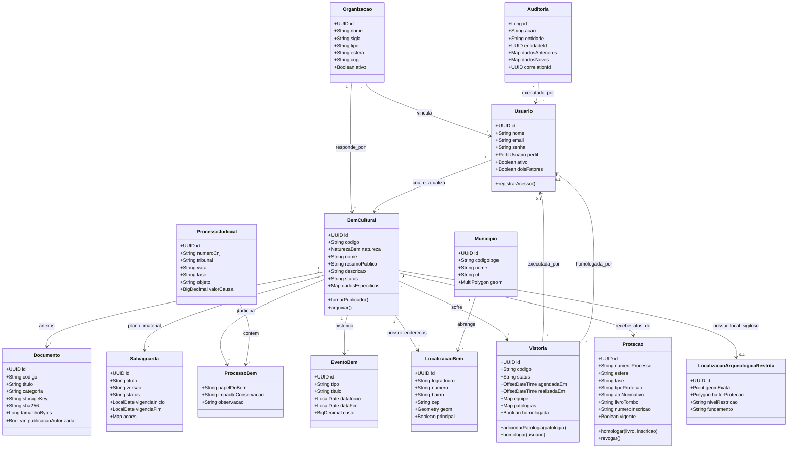

# Modelo de Classes de Domínio — SIP-MA

O Modelo de Classes de Domínio representa os conceitos de negócio, suas propriedades estruturais e seus relacionamentos no ecossistema de patrimônio e tombamento.

---

## Diagrama Conceitual de Classes (Mermaid)

